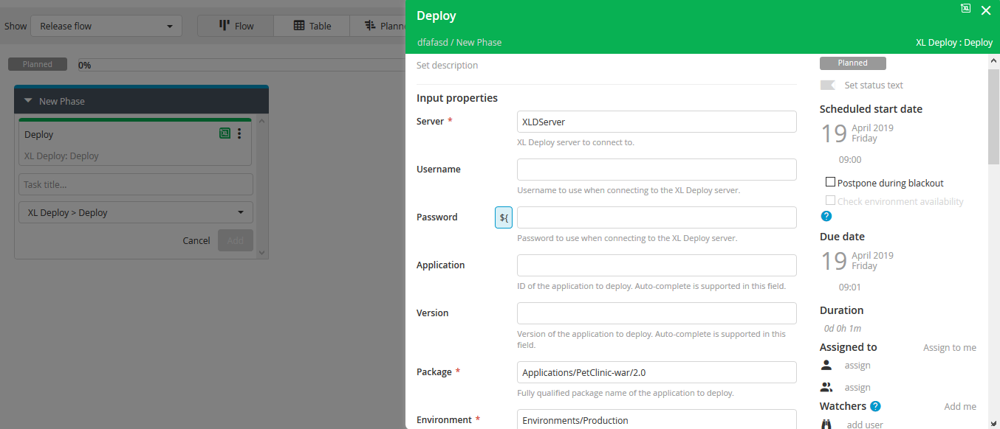
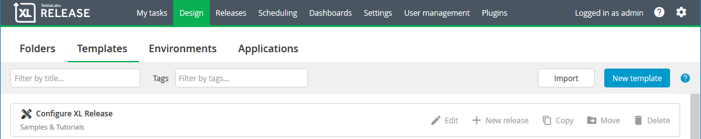
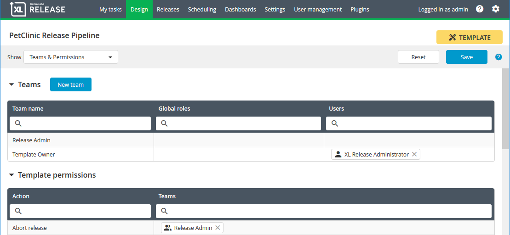
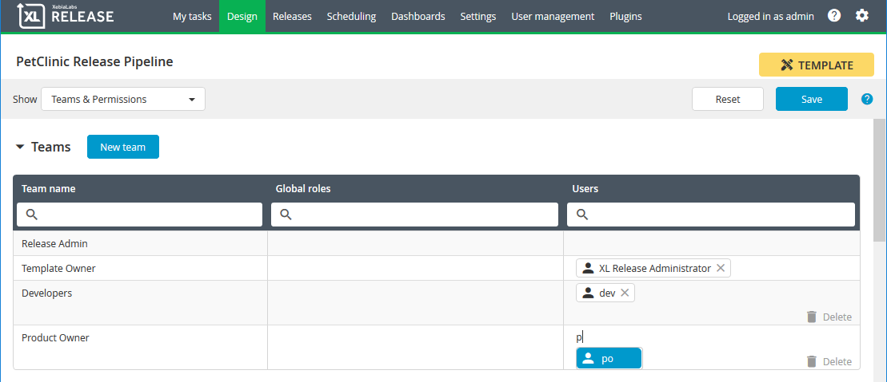
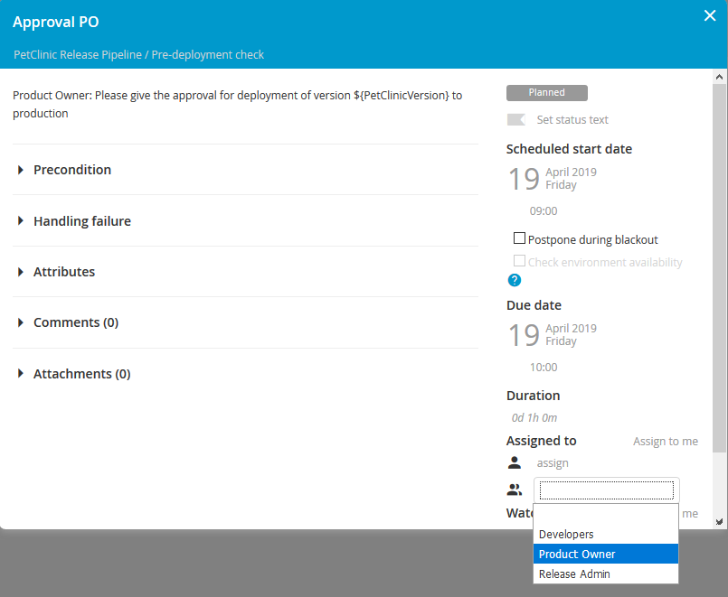
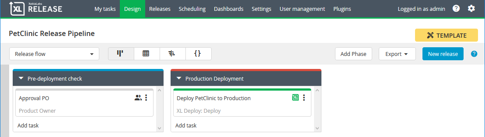
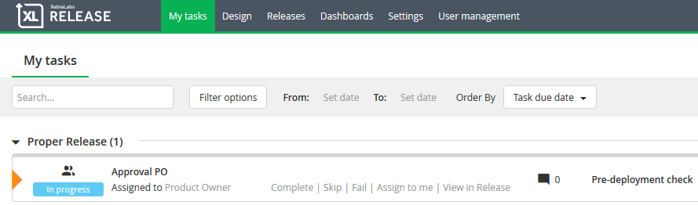
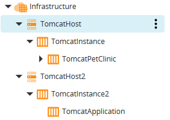
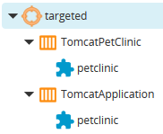
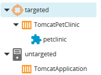

# XL-Deploy/XL-Release Hands-on

This hands-on will go through the basics of `XL-Deploy` and `XL-Release`. `XL-Deploy` is used for deploying applications and `XL-Release` for orchestrating your release pipeline. We'll use `PetClinic` as a "Hello World" appliction to demonstrate deployments and version differences. `PetClinic` is deployed on a Tomcat server. `XL-Deploy`, `XL-Release` and `Tomcat` are installed on a Alpine Linux VM using `VirtualBox`. 

## 1. Pre-requisites

* [Oracle VM VirtualBox](https://www.virtualbox.org/wiki/Downloads)
* Internet Browser, like Chrome, Firefox or Edge
* ***Optional***: If you want to check the VM, you can use a SSH terminal like [putty](https://www.putty.org/) to login to the VM(allows scaling of the command window and easy use of copy-paste)

## 2. Architecture


[Alpine Linux](https://alpinelinux.org/) hosts all applications used in this session. Tomcat is installed on the VM, while XL-Deploy and XL-Release are available as docker containers with data persistence on the VM. The VM is available as an appliance you can import in your VirtualBox. The appliance also takes care of the port mapping, so you can access the applications using **"localhost:\<portNumber\>"**

## 3. Getting Started

### Import VM as Appliance
Follow [these](https://www.maketecheasier.com/import-export-ova-files-in-virtualbox/) instructions to import the VM as an appliance(*.ova). You'll only need the instructions under paragraph `Importing an OVA` and keep the default settings of the appliance.

### Credentials
* VM 
    * User: `root`
    * Password: `devoteam2019`
* XL-Deploy/XL-Release:
    * User: `admin`
    * Password: `devoteam2019`

### URLs
* XL-Deploy: http://localhost:4516
* XL-Release: http://localhost:5516
* Tomcat: http://localhost:8080
* SSH VM: `localhost:22`
* Docker Ip\*: `172.17.0.1`

\*The "Docker Ip" is used to connect the containers and Tomcat over the network.

## 4. Let's do it!
This hands-on will go through the following:
* Deploy for the first time with `XL-Deploy`
* Create a simple release pipeline in `XL-Release`
* How to use tags in `XL-Deploy`
* .....

Start up the VM in `VirtualBox` and all tools should be available in about two to three minutes.

#### XL-Deploy: First Deployment
We going to deploy for the first time. In the next few paragraphs we'll guide you through the following steps:
* Import version 1.0 of the `PetClinic` application for deployment
* Define the `Tomcat` infrastructure
* Define an environment we can deploy `PetClinic` to
* Deploy version 1.0 of `PetClinic`
* Import version 2.0 of the `PetClinic` application for deployment
* Deploy and rollback version 2.0 of `PetClinic`

##### Import PetClinic
The developers have build the first version of `PetClinic` and it has to be deployed, so we need to make `PetClinic` available in `XL-Deploy`:
1. Login to [XL-Deploy](http://localhost:4516)
1. Click on the `...` next to `Applications`, then go to `Import` > `From XL Deploy Server`
1. Select `PetClinic-war/1.0` from the `Package` selection box and click `Import`
1. You should be able to see this:  


Now you have an application you can't deploy to anything. 

##### Infrastructure
We need to define the `Tomcat` infrastructure, so `XL-Deploy` knows where to deploy `PetClinic`. We'll start by defining the target host first:  
1. Click on the `...` next to `Infrastructure`, then go to `New` > `overthere` > `SshHost`
1. Fill in the following:
    * Name: `TomcatHost`
    * Operating system: `Unix`
    * Connection Type: `SCP`
    * Address: `172.17.0.1`
    * Port: `22`
    * Username: `root`
    * Password: `devoteam2019`
1. Click on `Save and close`
1. Click on the `...` next to `TomcatHost`, then go to `Check connection`
1. Click on `Execute` to verify the connection to the `Tomcat` host. If verification is successful, click on `Finish`

Now that we have a target host, we're going to tell `XL-Deploy` where the `Tomcat` instance is installed on that host:
1. Click on the `...` next to `TomcatHost`, then go to `New` > `tomcat` > `Server`
1. Fill in the following:
    * Name: `TomcatInstance`
    * Home: `/usr/local/tomcat/apache-tomcat-9.0.17`
    * Start Command: `/usr/local/tomcat/apache-tomcat-9.0.17/bin/startup.sh`
    * Stop Command: `/usr/local/tomcat/apache-tomcat-9.0.17/bin/shutdown.sh`
1. Click on `Save and close`

Last step in the infrastructure is to define where `PetClinic` needs to be deployed:
1. Click on the `...` next to `TomcatInstance`, then go to `New` > `tomcat` > `VirtualHost`
1. Fill in the following:
    * Name: `TomcatPetClinic`
1. Click on `Save and close`

The end result should look like this:  


We can't deploy on infrastructure in `XL-Deploy`, we need an environment for that.

#### Environment
An environment is nothing more than a grouping of one or more infrastructure entries you can deploy to. In this case the environment will only contain `TomcatPetClinic`.

1. Click on the `...` next to `Environments`, then go to `New` > `Environment`
1. Fill in the following:
    * Name: `Production` (because that's how we roll)
    * Containers: `Infrastructure/TomcatHost/TomcatInstance/TomcatPetClinic`
1. Click on `Save and close`

#### First Deployment
Finally we can deploy `PetClinic`. 

1. First check if you get a `HTTP 404` error when opening [PetClinic](http://localhost:8080/petclinic/) in your browser
1. In `XL-Deploy` click on the big `Start a deployment` button in the center:  

1. Drag and drop the following:
    * `Applications/PetClinic-war/1.0` to `Drag and drop package here`
    * `Environments/Production` to `Drag and drop environment here`
1. Click on `Preview` to see what tasks `XL-Deploy` will execute to deploy `PetClinic`
1. Click on `Close preview` to return to the previous view
1. Click on `Deploy` and `PetClinic` should be deployed in seconds
1. Go to [PetClinic](http://localhost:8080/petclinic/) and browse the application:  

1. Go back to `XL-Deploy` and click on `Finish`. This will tell `XL-Deploy` you accept this deployment. 

#### Here Comes a New Version
`PetClinic` 1.0 is running all fine and dandy, but the developers have build a second version we need to deploy to production.

1. Click on the `...` next to `Applications`, then go to `Import` > `From XL Deploy Server`
1. Select `PetClinic-war/2.0` from the `Package` selection box and click `Import`
1. You should be able to see this:  


Hhhmm, importing a new version takes time. Maybe something that the developers can automate? :)

#### Rollback
Let's see what happens if we deploy version 2.0

1. In `XL-Deploy` click on the big `Start a deployment` button in the center:  

1. Drag and drop the following:
    * `Applications/PetClinic-war/2.0` to `Drag and drop package here`
    * `Environments/Production` to `Drag and drop environment here`
1. Click on `Preview` and you can see that a task called `Destroy petclinic on TomcatPetClinic` has been added. Depending on if it's a first deploy, update or undeploy, `XL-Deploy` will change the tasks accordingly.
1. Click on `Close preview` to return to the previous view
1. Click on `Deploy` and `PetClinic` should be deployed in seconds. 
1. Go to [PetClinic](http://localhost:8080/petclinic/). You see that the image on the homepage has been changed (if not: refresh the page):  

1. Let's say we don't like the new image in version 2.0 and we want to rollback to version 1.0. Go back to `XL-Deploy` and click on `Rollback`, then `Yes`. 
1. Go back to [PetClinic](http://localhost:8080/petclinic/) and refresh the page. The image should revert to this:  

1. Ah, much better. Go back to `XL-Deploy` and click on `Finish` to accept the deployment. Should you want to rollback after accepting a deployment, you can always start a new deployment.

#### XL-Release: First Release Pipeline
When you want to get your software to production, deploying is probably not the only thing you'll need to do. Most organisation have checks and quality gates in place software needs to comply to to be allowed to go to production. An option is to do those tasks separately, but a better option is to all the tasks together in a single overview, so everone can easily see what the progress is of your software. This is where `XL-Release` comes in. `XL-Release` not only shows the status of a release, but can also start tasks, so it can function as a orchestrator.

##### First Release
We're going to deploy a version of `PetClinic` with `XL-Release`.

1. Login to [XL-Release](http://localhost:5516)
1. Before we can start creating releases, we need to register the `XL-Deploy` server: Click on `Settings` > `Shared configuration`
1. Scroll down to `XL Deploy Server` and click on the `+` symbol next to it.
1. Fill in the following:
    * Title: `XLDServer`
    * Url: `http://172.17.0.1:4516`
    * Authentication Method: `Basic`
    * Username: `admin`
    * Password: `devoteam2019`
1. Click on `Test` to verify the connection to `XL-Deploy`. You should get the `XL Deploy Server is available.` message. 
1. Click on `Save`
1. Now that we have a `XL-Deploy` server that can deploy `PetClinic`, we can create the first release: In the top menu click on `Releases`, then in the new screen `New release`

1. Enter a name for the release and click on `Create`
1. Now we can add our deployment task in the release. Click on `Add task`.
1. Give the task a new and from the dropdown menu select: `XL-Deploy` > `Deploy` and click on `Add`
1. Click on the task to open it. Fill in the following:
    * Server: `XLDServer`
    * Package: `Applications/PetClinic-war/2.0`
    * Environment: `Environments/Production` (there's an auto-complete function when you start typing)  
    
1. Click outside of the task to close it, it saves your input automatically. 
1. Now that we have defined the release let's start it: Click on `Start Release` > `Start`
1. The tasks should say `In Progress` and after the release is complete, check [PetClinic](http://localhost:8080/petclinic/) to verify version 2.0 is deployed:  


##### Using Templates
Adding a task for each release is doable, but usually a release pipeline has way more tasks than one. To save time, `XL-Release` has templates you can create to start your releases from. That way you have a single point where you add, update or remove tasks you need for a release.

1. Go to `Design` > `Templates` > `New template`  

1. Enter `PetClinic Release Pipeline` for `Template name` and click on `Create`
1. Add the `XL-Deploy` task like previously and fill in the following:
    * Name: `Deploy PetClinic to Production`
    * Task Type: `XL-Deploy` > `Deploy`
    * Server: `XLDServer`
    * Package: `Applications/PetClinic-war`
    * Environment: `Environments/Production` (there's an auto-complete function when you start typing)
1. Hey, where's the version of `PetClinic`? Well, you don't want to start each release with the same version, do you? ;) Let's make the version variable, so each release can have a different version: On the top-left you'll see a dropdown menu called `Show`. In that menu select `Variables`.
1. Click on `New variable` and name it `PetClinicVersion` 
1. In the dropdown select `Release flow` to go back. 
1. Open task `Deploy PetClinic to Production` and add the new variable in the Package field, like so: `Applications/PetClinic-war/${PetClinicVersion}`
1. Now let's see if this works. Click on `New release`, give the release a name and enter `1.0` for the `PetClinicVersion`. Click on `Create`, then `Start release` > `Start`
1. Wait for the release to finish and go to [PetClinic](http://localhost:8080/petclinic/) to verify version 1.0 is running (refresh if necessary):  


##### Users and Assigned Tasks
Like mentioned in the beginning, release pipelines consist of more tasks than just deploying. In many organisations there's an approval needed to be allowed to deploy to production. Here we're going to play a scenario with a `Developer` and a `Product Owner`. The `Developer` keeps an eye on the pipeline and the `Product Owner` is the only one who can give the approval.

First we're going to create the user accounts for the both of them.
1. Go to `User management` > `Users`
1. Click on `New user` and fill in the following:
    * Username: `dev`
    * Set password: `dev`
    * Confirm password: `dev`
1. Click on `Save`
1. Repeat steps two and three for the `Product Owner`
    * Username: `po`
    * Set password: `po`
    * Confirm password: `po`

Change the permissions of the `PetClinic Release Pipeline` template for the `Developer` and `Product Owner`
1. Go to the `PetClinic Release Pipeline` template and select from the dropdown menu `Teams and permissions`. You'll see two parts: One where you can define teams and one where you can assign users or teams to the available permissions:  

1. We're going to create two teams. Click on `New team` and name it `Developers` and click on `Create`.
1. Create another team called `Product Owner`
1. Add the `dev` user to team `Developers` and user `po` to `Product Owner` by clicking in the `Users` column of the team and start typing the user you want to add. There's an auto-complete, so when the user appears, click on it:  

1. Now we're going to give the teams some permissions. Add the `Developers` team to permissions `Create release`, `Start release`, `View release`, and `View template`. Add `Product Owner` to `View release`,and `View template`.
1. Be careful in this screen! Unlike in the `Release flow` screen changes aren't saved automatically: So click on `Save`!

Let's add an approval to the template
1. Select `Release flow` from the dropdown menu
1. Click on `Add phase`, name it `Pre-deployment check` and move it to the left by dragging and dropping it. Rename the old phase `Production Deployment` and give the phase the color `Red`.
1. Click on `Add task` within the `Pre-deployment check` phase, name it `Approval PO` and click on `Add` (the task type should already be set on `Manual`). 
1. Open the `Approval PO` task. Edit the description to `Product Owner: Please give the approval for deployment of version ${PetClinicVersion} to production` and click `Save`. Assign team `Product Owner` to the task:  

1. Close the task and result should look like this:  


Now we're going to start a release with the `dev` user and approve it with the `po` user.
1. Open a incognito window of your browser. Go to [XL-Release](http://localhost:5516) and login with the `dev` user.
1. Create a release from the `PetClinic Release Pipeline` template called `Proper Release` with `PetClinicVersion` 2.0. Now start the release.
1. Log out by clicking on the gears symbol on the top-right and clicking on `Log out`
1. Log in with the `po` user and click on `My tasks`
1. You should see the `Approval PO` assigned to the `Product Owner` for `Proper Release`:  
  
If you login with another user, you won't see the `Approval PO` task in `My tasks`
1. Open the `Approval PO` task and click on `Complete`, then fill in the field and click on `OK`
1. Once the release is done, check [PetClinic](http://localhost:8080/petclinic/) to verify version 2.0 is deployed:  


#### XL-Deploy: Tagging
With tagging you can make sure that applications can only be deployed on certain servers. In this scenario we going to define a second `Tomcat` server in the `Production` environment and assign the `PetClinic` tag to application and the first `Tomcat` server, so it will only be deployed there.

1. Login to [XL-Deploy](http://localhost:4516)
1. Follow the steps at **[Infrastructure](#infrastructure)**, but change the name of each `Tomcat` infrastructure entry. Like so:  

1. Edit the `Production` environment and add  `Infrastructure/TomcatHost2/TomcatInstance2/TomcatApplication` to `Containers`
1. Create (but don't start) a deployment to `Production` and `PetClinic` version 1.0. You'll see that `PetClinic` is added to both `TomcatPetClinic` and `TomcatPetApplication`. Open the preview to see what tasks are executed. Cancel the deployment.  

1. Now we're going to add the tag `PetClinic` to make sure its only deployed to `TomcatPetClinic`. Open `Infrastructure/TomcatHost/TomcatInstance/TomcatPetClinic` and enter `PetClinic` in the `Tags` field and click on `Add`, then `Save and close`.
1. Open `Applications/PetClinic-war/1.0/petclinic` and add the tag `PetClinic` in the `Tags` field and click on `Add`, then `Save and close`.
1. Open `Applications/PetClinic-war/2.0/petclinic` and add the tag `PetClinic` in the `Tags` field and click on `Add`, then `Save and close`.
1. Start a deployment of `PetClinic` version 1.0 to `Production` and you'll see that only server `TomcatPetClinic` is selected as target.  


## 5. Start XL-Deploy and XL-Release for own evaluation
I got the Docker images from XebiaLabs themselves:
* `XL-Deploy`: https://hub.docker.com/r/xebialabs/xl-deploy/
* `XL-Release`: https://hub.docker.com/r/xebialabs/xl-release/

The Docker containers in the VM use my trial license which will expire. You can get your own trial license here:
* `XL-Deploy`: https://xebialabs.com/products/xl-deploy/trial/
* `XL-Release`: https://xebialabs.com/products/xl-release/trial/

I applied the licenses by adding them as an environment variable in the docker run command:
* `XL-Deploy`:  
    ```
    docker run -d -p 4516:4516 \
        -e "ADMIN_PASSWORD=<password>" \
        -e "XL_LICENSE=<licenseString>" \
        -v /home/xebialabs/xl-deploy-server/conf:/opt/xebialabs/xl-deploy-server/conf:rw \
        -v /home/xebialabs/xl-deploy-server/repository:/opt/xebialabs/xl-deploy-server/repository:rw \
        -v /home/xebialabs/xl-deploy-server/archive:/opt/xebialabs/xl-deploy-server/archive:rw \
        --name xld xebialabs/xl-deploy:8.6.1
    ```
* `XL-Release`:  
    ```
    docker run -d -p 5516:5516 \
        -e "ADMIN_PASSWORD=<password>" \
        -e "XL_LICENSE=<license>" \
        -v /home/xebialabs/xl-release-docker/conf:/opt/xebialabs/xl-release-server/conf:rw \
        -v /home/xebialabs/xl-release-docker/repository:/opt/xebialabs/xl-release-server/repository:rw \
        -v /home/xebialabs/xl-release-docker/archive:/opt/xebialabs/xl-release-server/archive:rw \
        --name xlr xebialabs/xl-release:8.6.1
    ```  
    If you're using the VM, you might need to delete the `*.lic` file in `/home/xebialabs/xl-release-docker/conf` first before running the Docker image.

If you want to run the Docker images on your own host/VM, make sure the volume paths have full permissions, otherwise the default configuration from the container can't be copied and will cause the container to stop. This caused by the default configuration files having a different user as owner than root in the container. No idea why XebiaLabs did that.