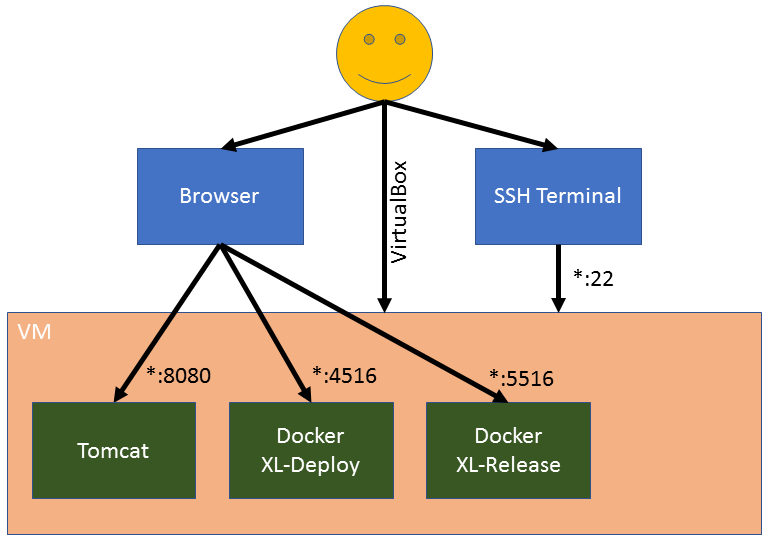
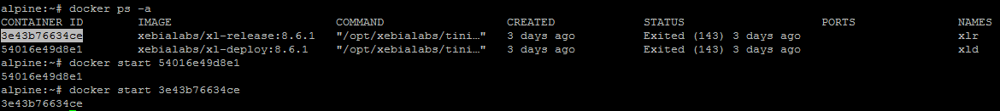
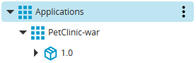
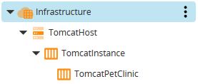
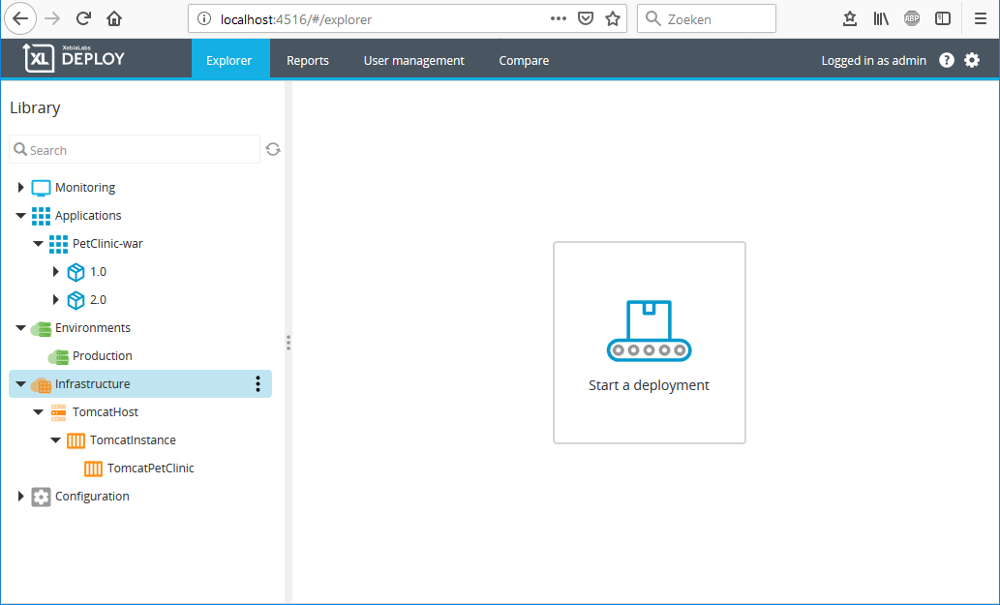
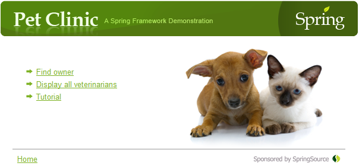
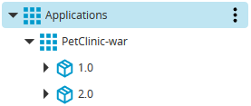
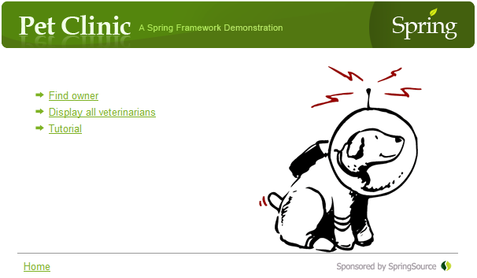

# XL-Deploy/XL-Release Hands-on

This hands-on will go through the basics of `XL-Deploy` and `XL-Release`. `XL-Deploy` is used for deploying applications and `XL-Release` for orchestrating your release pipeline. We'll use `PetClinic` as a "Hello World" appliction to demonstrate deployments and version differences. `PetClinic` is deployed on a Tomcat server. `XL-Deploy`, `XL-Release` and `Tomcat` are installed on a Alpine Linux VM using `VirtualBox`. 

## 1. Pre-requisites

* [Oracle VM VirtualBox](https://www.virtualbox.org/wiki/Downloads)
* Internet Browser, like Chrome, Firefox or Edge
* ***Optional***: You can use a SSH terminal like [putty](https://www.putty.org/) to login to the VM(allows scaling of the command window and easy use of copy-paste)

## 2. Architecture

[Alpine Linux](https://alpinelinux.org/) hosts all applications used in this session. Tomcat is installed on the VM, while XL-Deploy and XL-Release are available as docker containers with data persistence on the VM. The VM is available as an appliance you can import in your VirtualBox. The appliance also takes care of the port mapping, so you can access the applications using **"localhost:\<portNumber\>"**

## 3. Getting Started

### Import VM as Appliance
Follow [these](https://www.maketecheasier.com/import-export-ova-files-in-virtualbox/) instructions to import the VM as an appliance(*.ova). You'll only need the instructions under paragraph `Importing an OVA` and keep the default settings of the appliance.

### Credentials
* VM 
    * User: `root`
    * Password: `devoteam2019`
* XL-Deploy/XL-Release:
    * User: `admin`
    * Password: `devoteam2019`

### URLs
* XL-Deploy: http://localhost:4516
* XL-Release: http://localhost:5516
* Tomcat: http://localhost:8080
* SSH VM: `localhost:22`
* Docker Ip\*: `172.17.0.1`

\*The "Docker Ip" is used to connect the containers and Tomcat over the network.

## 4. Start VM and its applications
1. Start the VM with VirtualBox
1. Login to the VM using VirtualBox or a SSH Terminal (Check the **[Credentials](#credentials)** paragraph above for username and password)
1. Execute the following command to get the `CONTAINER ID`s to start `XL-Deploy` and `XL-Release` in the next step:  
`docker ps -a`  

1. Start both containers using the following command:  
`docker start <containerId>`
1. The applications should become available in a minute or two.

## 5. Let's do it!
This hands-on will go through the following:
* Deploy for the first time with `XL-Deploy`
* Create a simple release pipeline in `XL-Release`
* How to use tags in `XL-Deploy`
* .....

#### XL-Deploy: First Deployment
We going to deploy for the first time. In the next few paragraphs we'll guide you through the following steps:
* Import version 1.0 of the `PetClinic` application for deployment
* Define the `Tomcat` infrastructure
* Define an environment we can deploy `PetClinic` to
* Deploy version 1.0 of `PetClinic`
* Import version 2.0 of the `PetClinic` application for deployment
* Deploy and rollback version 2.0 of `PetClinic`

##### Import PetClinic
The developers have build the first version of `PetClinic` and it has to be deployed, so we need to make `PetClinic` available in `XL-Deploy`:
1. Login to [XL-Deploy](http://localhost:4516)
1. Click on the `...` next to `Applications`, then go to `Import` > `From XL Deploy Server`
1. Select `PetClinic-war/1.0` from the `Package` selection box and click `Import`
1. You should be able to see this:  

Now you have an application you can't deploy to anything. 

##### Infrastructure
We need to define the `Tomcat` infrastructure, so `XL-Deploy` knows where to deploy `PetClinic`. We'll start by defining the target host first:  
1. Click on the `...` next to `Infrastructure`, then go to `New` > `overthere` > `SshHost`
1. Fill in the following:
    * Name: `TomcatHost`
    * Operating system: `Unix`
    * Connection Type: `SCP`
    * Address: `172.17.0.1`
    * Port: `22`
    * Username: `root`
    * Password: `devoteam2019`
1. Click on `Save and close`
1. Click on the `...` next to `TomcatHost`, then go to `Check connection`
1. Click on `Execute` to verify the connection to the `Tomcat` host. If verification is successful, click on `Finish`

Now that we have a target host, we're going to tell `XL-Deploy` where the `Tomcat` instance is installed on that host:
1. Click on the `...` next to `TomcatHost`, then go to `New` > `tomcat` > `Server`
1. Fill in the following:
    * Name: `TomcatInstance`
    * Home: `/usr/local/tomcat/apache-tomcat-9.0.17`
    * Start Command: `/usr/local/tomcat/apache-tomcat-9.0.17/bin/startup.sh`
    * Stop Command: `/usr/local/tomcat/apache-tomcat-9.0.17/bin/shutdown.sh`
1. Click on `Save and close`

Last step in the infrastructure is to define where `PetClinic` needs to be deployed:
1. Click on the `...` next to `TomcatInstance`, then go to `New` > `tomcat` > `VirtualHost`
1. Fill in the following:
    * Name: `TomcatPetClinic`
1. Click on `Save and close`

The end result should look like this:  

We can't deploy on infrastructure in `XL-Deploy`, we need an environment for that.

#### Environment
An environment is nothing more than a grouping of one or more infrastructure entries you can deploy to. In this case the environment will only contain `TomcatPetClinic`.

1. Click on the `...` next to `Environments`, then go to `New` > `Environment`
1. Fill in the following:
    * Name: `Production` (because that's how we roll)
    * Containers: `Infrastructure/TomcatHost/TomcatInstance/TomcatPetClinic`
1. Click on `Save and close`

#### First Deployment
Finally we can deploy `PetClinic`. 

1. First check if you get a `HTTP 404` error when opening [PetClinic](http://localhost:8080/petclinic/) in your browser
1. In `XL-Deploy` click on the big `Start a deployment` button in the center:  

1. Drag and drop the following:
    * `Applications/PetClinic-war/1.0` to `Drag and drop package here`
    * `Environments/Production` to `Drag and drop environment here`
1. Click on `Preview` to see what tasks `XL-Deploy` will execute to deploy `PetClinic`
1. Click on `Close preview` to return to the previous view
1. Click on `Deploy` and `PetClinic` should be deployed in seconds
1. Go to [PetClinic](http://localhost:8080/petclinic/) and browse the application:  

1. Go back to `XL-Deploy` and click on `Finish`. This will tell `XL-Deploy` you accept this deployment. 

#### Here Comes a New Version
`PetClinic` 1.0 is running all fine and dandy, but the developers have build a second version we need to deploy to production.

1. Click on the `...` next to `Applications`, then go to `Import` > `From XL Deploy Server`
1. Select `PetClinic-war/2.0` from the `Package` selection box and click `Import`
1. You should be able to see this:  

Hhhmm, importing a new version takes time. Maybe something that the developers can automate? :)

#### Rollback
Let's see what happens if we deploy version 2.0

1. In `XL-Deploy` click on the big `Start a deployment` button in the center:  

1. Drag and drop the following:
    * `Applications/PetClinic-war/2.0` to `Drag and drop package here`
    * `Environments/Production` to `Drag and drop environment here`
1. Click on `Preview` and you can see that a task called `Destroy petclinic on TomcatPetClinic` has been added. Depending on if it's a first deploy, update or undeploy, `XL-Deploy` will change the tasks accordingly.
1. Click on `Close preview` to return to the previous view
1. Click on `Deploy` and `PetClinic` should be deployed in seconds. 
1. Go to [PetClinic](http://localhost:8080/petclinic/). You see that the image on the homepage has been changed (if not: refresh the page):  

1. Let's say we don't like the new image in version 2.0 and we want to rollback to version 1.0. Go back to `XL-Deploy` and click on `Rollback`, then `Yes`. 
1. Go back to [PetClinic](http://localhost:8080/petclinic/) and refresh the page. The image should revert to this:  

1. Ah, much better. Go back to `XL-Deploy` and click on `Finish` to accept the deployment. Should you want to rollback after accepting a deployment, you can always start a new deployment.

#### XL-Release: First Release Pipeline

#### XL-Deploy: Reporting

#### XL-Deploy: Tagging

